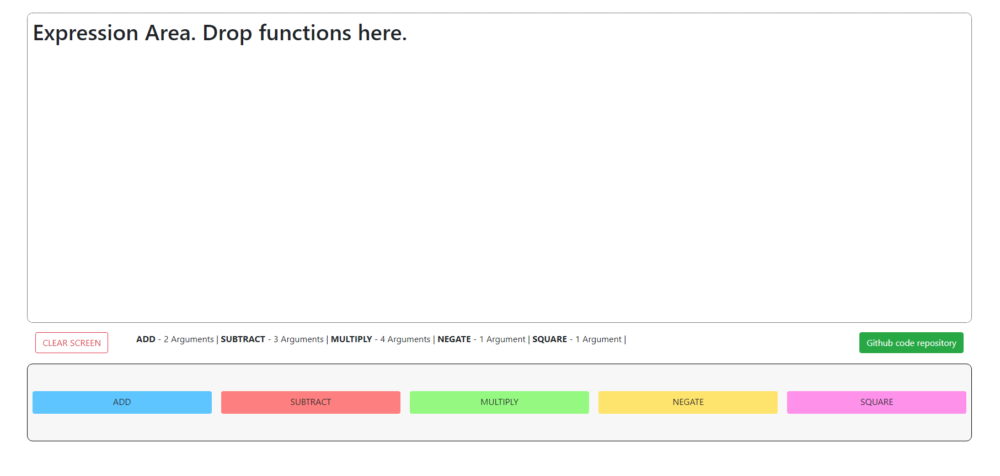

## DEMO: [http://www.sarthakkhanna.me/keysight/](http://www.sarthakkhanna.me/keysight/)

### Objective
Creating a UI with drag and drop features to create expressions.

### Technologies used
- JavaScript
- jQuery & jQuery UI
- HTML/CSS
- Bootstrap

### Basic Functionality
- The user can drag and drop one of the functons into the expression area. This will create placeholder divs (based on the number of arguments of the function dropped). 
- After initial function is dropped. User can either clear the expression area or drop the function in the white areas of the expression area to replace the first function dropped
- To create nested or recursive functions, drop the function into the color area of the expression area which is visible after the initial drop of any function. 

### Assumptions
- Dropping will create new placeholder Divs.
- Functions are available on page load and do not change dynamically.
- Currently only 5 functions with multiple number of arguments:
    - ADD - 2 arguments
    - SUBTRACT - 3 arguments
    - MULTIPLY - 4 arguments
    - NEGATE - 1 argument
    - SQUARE - 1 argument
- More functions can be added or the present ones can be replaced. 

### Additional Features
- **Clear Screen** : clears the expression area
- **Recursion Depth**: Currently functions are droppable indefinitely, but can be capped by setting the level and depth variables. 

### Screenshots:
1. Basic UI

2. UI with functions dropped
